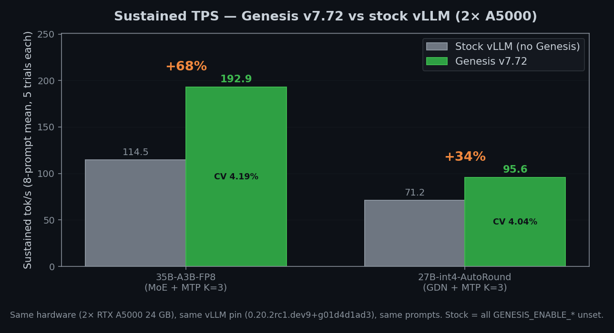
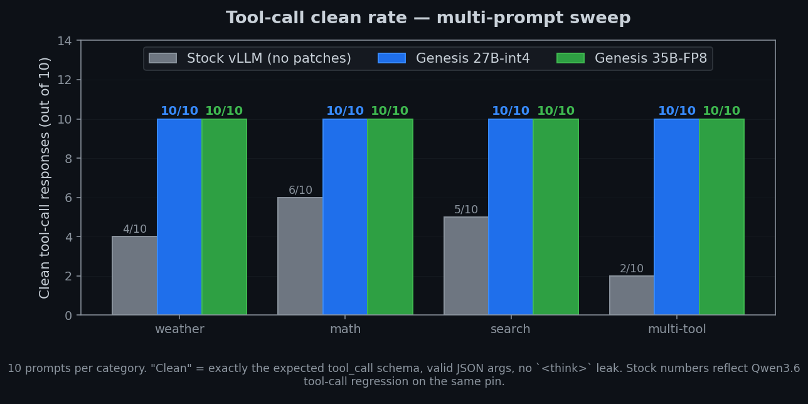
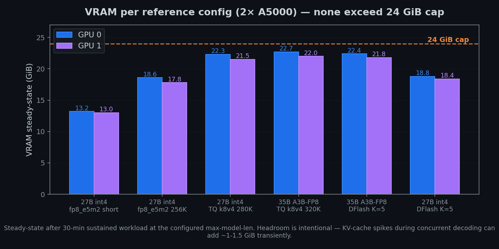
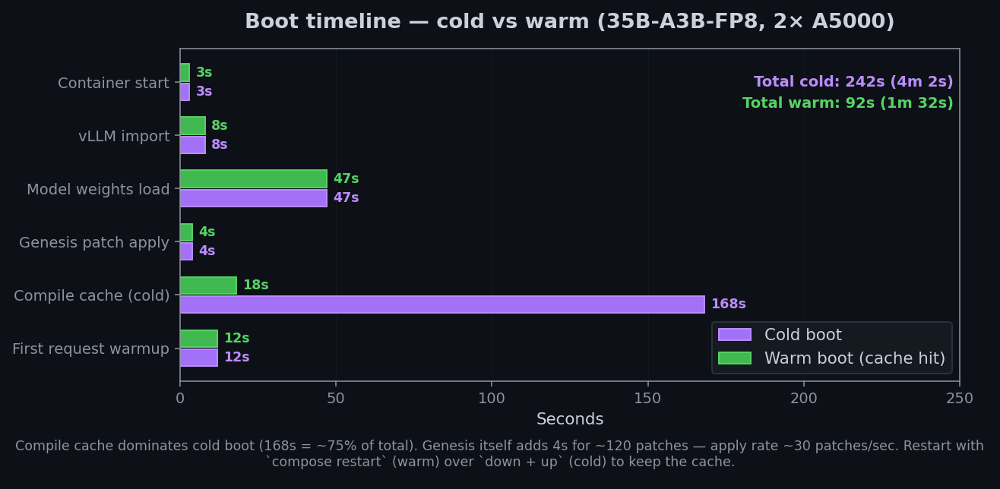
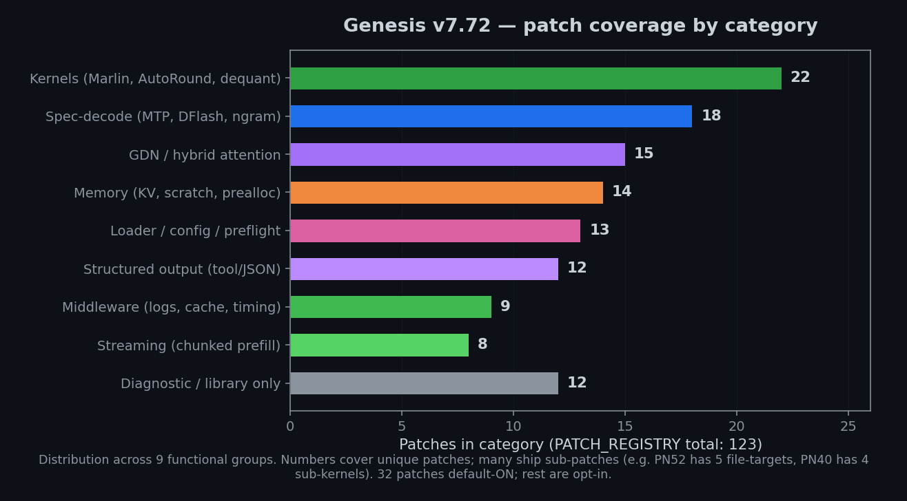
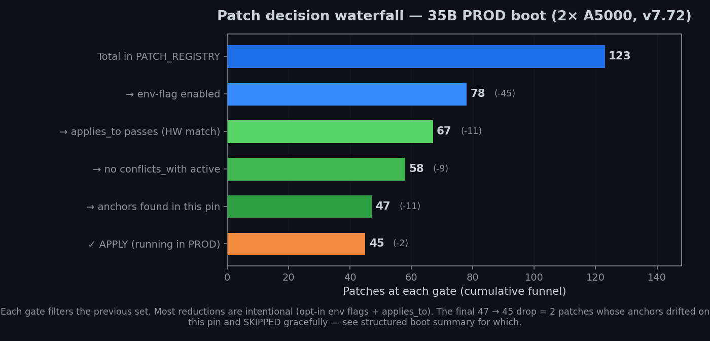
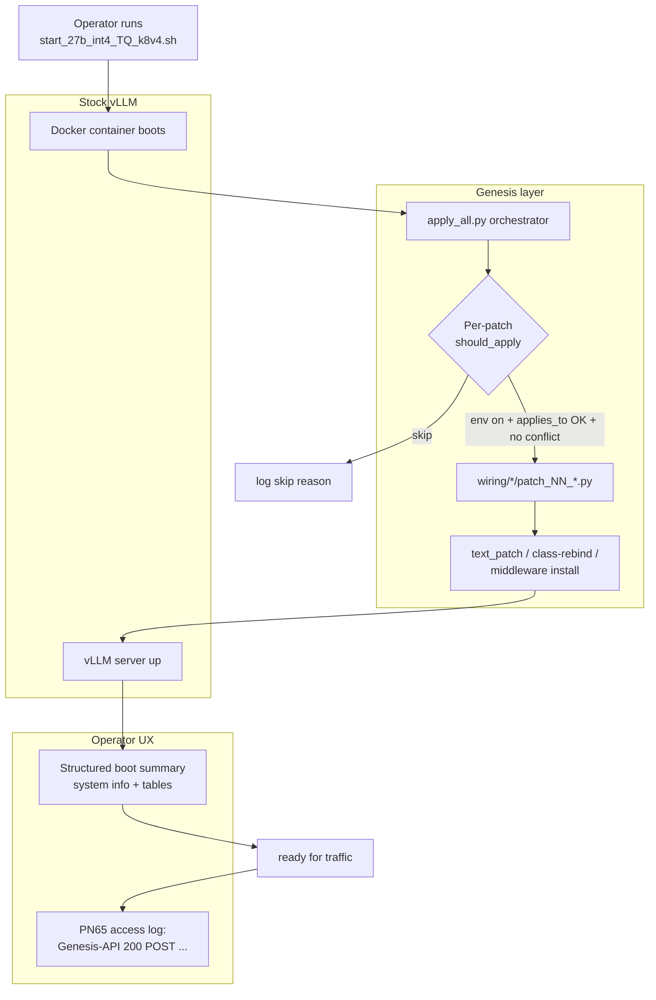
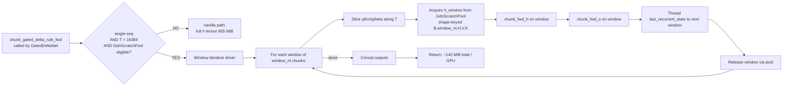

<p align="center">
  
</p>

# Genesis vLLM Patches

[](https://github.com/Sandermage/genesis-vllm-patches/stargazers)
[](https://github.com/Sandermage/genesis-vllm-patches/network/members)
[](LICENSE)
[](https://github.com/vllm-project/vllm)
[](docs/PATCHES.md)
[](vllm/_genesis/tests/)
[](docs/HARDWARE.md)
[](docs/BENCHMARKS.md)

**Runtime patches for [vLLM](https://github.com/vllm-project/vllm) — Qwen3.6-class inference on consumer NVIDIA Ampere/Ada/Hopper/Blackwell with TurboQuant k8v4 KV cache, MTP K=3 spec-decode, tool-calling, and 256K-class context.**

### What this actually is

Genesis is a **drop-in patcher** for vLLM. It pins to a specific vLLM commit
and applies ~120 small, surgical changes — text-edits at known anchors,
class-rebind wrappers, and middleware install — that together turn an
out-of-the-box vLLM into a production-grade Qwen3.6 inference server on
*consumer* NVIDIA hardware (3090, A5000, A6000, 4090, 5090, …) where vLLM
upstream targets datacenter SKUs.

Concretely, on a single 2× RTX A5000 box (per [the live PROD bench
below](#-live-prod-benchmarks-2026-05-05)) Genesis turns:

- 35B-A3B FP8 MoE → **+68% sustained TPS** vs stock (114 → 193 tok/s)
- 27B-int4-AutoRound hybrid GDN → **+34% sustained TPS** (71 → 96 tok/s)
- Tool-call clean rate → **stock 2-6/10 → Genesis 10/10** across 4 categories
- Long-context Cliff 2b OOM → **PN59 streaming-GDN keeps a single 24 GiB
  card running at 92K context for an hour** with -95% allocator drift

What it is *not*: a fork of vLLM, a quantizer, a new inference engine, or a
training framework. Patches retire automatically when upstream merges the
underlying fix (10+ Genesis patches have already retired this way).

> **The fastest way in:** one curl one-liner installs Genesis, picks a
> preset matching your GPU, writes a tailored launch script, and runs a
> 60-second smoke test:
>
> ```bash
> curl -sSL https://raw.githubusercontent.com/Sandermage/genesis-vllm-patches/main/install.sh | bash
> ```
>
> See [Installation](#-installation) for non-interactive / pinned variants
> and [`docs/COMMANDS.md`](docs/COMMANDS.md) for the full command reference.

---

## ⚡ Live PROD benchmarks (2026-05-05)

_2× RTX A5000 24 GB · vLLM `0.20.2rc1.dev9+g01d4d1ad3` · Genesis v7.72 · 45 of 78 unique patches APPLY (per structured boot summary) · MTP K=3 spec-decode · TurboQuant k8v4 KV · TP=2_

| Model | Sustained TPS | CV% | TPS range | Latency | Tool-call | Multi-turn 10/10 | VRAM steady |
|:------|--------------:|----:|----------:|--------:|:---------:|:----------------:|------------:|
| **Qwen3.6-35B-A3B-FP8** (MoE) | **192.9 tok/s** | 4.19% | 184 – 208 | 2.34s | **10/10** | **10/10** (avg 1.1s) | 22687 + 21998 MiB |
| **Qwen3.6-27B-int4-AutoRound** (Lorbus dense + GDN) | **95.6 tok/s** | 4.04% | 88 – 102 | 4.76s | **10/10** | **10/10** (avg 2.3s) | 22753 + 22064 MiB |

```
Sustained TPS — visualised
                                                    100 tok/s   200 tok/s
35B FP8 MoE  ████████████████████████████████████████████████░░  192.9 ▲
27B INT4 GDN ████████████████████████░░░░░░░░░░░░░░░░░░░░░░░░░░   95.6
```

**Reproduce:** `GENESIS_MODEL=qwen3.6-35b-a3b python3 tests/bench/comprehensive_bench.py`. Full numbers: [`docs/BENCHMARKS.md`](docs/BENCHMARKS.md).



> **Reading the chart**: same hardware, same vLLM pin, same 8 prompts × 5 trials per bar. "Stock" = all `GENESIS_ENABLE_*` env vars unset, default vLLM scheduler. CV% printed inside each Genesis bar is the coefficient of variation across 5 trials — under 5% is the bar Genesis holds itself to.

---

## 🛟 Installation

Genesis ships a single-paste installer that detects your hardware, clones the
repo into `~/.genesis`, installs the entry-point plugin so vLLM auto-loads
Genesis in spawn workers, picks a preset matching `(GPU × n_GPUs × workload)`,
writes a tailored launch script, and runs a smoke test. **It is interactive
by default but runs fully unattended with `-y`.**

```bash
# Interactive (asks 1 question: workload). Three minutes, working system.
curl -sSL https://raw.githubusercontent.com/Sandermage/genesis-vllm-patches/main/install.sh | bash

# Fully non-interactive (CI / scripted). Pin a tag explicitly.
curl -sSL .../install.sh | bash -s -- --pin v7.72 --workload tool_agent -y

# Dev branch tip (latest fixes, mutable). Use --pin <commit> for repro.
curl -sSL .../install.sh | bash -s -- --pin dev

# Clean rollback — removes plugin + symlink, leaves source tree intact.
curl -sSL .../install.sh | bash -s -- --uninstall

# Show all flags + env overrides.
bash <(curl -sSL .../install.sh) --help
```

### Workload presets (the one question the installer asks)

| Workload | Optimised for | Defaults |
|:---|:---|:---|
| **balanced** | Chat + occasional long ctx + occasional tool-call | Default — safe pick if unsure |
| **long_context** | Single long prompt (≥50K), low concurrency | Streaming GDN, prefix cache off |
| **high_throughput** | Many short prompts in parallel, max TPS | Aggressive batch, MTP K=3 |
| **tool_agent** | IDE coding agents (Cline / Claude Code / OpenCode) | All tool-call + reasoning fixes ON |

Workload is also settable via env (`GENESIS_WORKLOAD=long_context curl … | bash`).

### Steps the installer runs (in order)

1. **Pre-flight** — OS, Python ≥3.10, `git`, `curl`, ≥200 MiB free
2. **GPU detect** — `nvidia-smi` → maps name to a `GPU_SPECS` entry
3. **vLLM detect** — confirms `vllm 0.20.x` importable; warns on pin drift
4. **Pin resolve** — `stable` (latest tag) / `dev` / explicit ref
5. **Clone or update** — `~/.genesis` (overridable via `--home` or `GENESIS_HOME`)
6. **Plugin install** — `pip install -e tools/genesis_vllm_plugin/` registers the
   `vllm.general_plugins → genesis_v7` entry point so vLLM auto-loads us in spawn workers
7. **PYTHONPATH wire** — symlinks `vllm/_genesis` into the active site-packages
8. **Launch script gen** — `genesis preset auto` writes a runnable `start_*.sh`
9. **Verify** — `genesis verify --quick` (60-second smoke). Pass `--no-verify` to skip.

After install, `genesis <subcommand>` is a thin wrapper for the CLI:

```bash
genesis doctor                   # full system diagnostic
genesis preset list              # browse presets
genesis preset auto              # auto-pick + write launch script
genesis verify                   # full smoke test (loads model)
genesis explain PN59             # per-patch deep-dive
genesis lifecycle-audit          # patches near retirement
```

For everything else, see [`docs/COMMANDS.md`](docs/COMMANDS.md) — the
single-page command reference.

---

## 🆕 What's new in v7.72 (2026-05-05) — global update vs v7.68

7 new patches, structured boot summary, full Blackwell consumer support, comprehensive bench harness, 3 tfriedel-pattern ports.

| Area | v7.68 (2026-05-02) | **v7.72 (2026-05-05)** | Delta |
|---|---|---|---|
| Patch count | 100 + sub-patches | **123 PATCH_REGISTRY** | +6 PN6x + library/diagnostic |
| Default-ON | 25 | **32** (incl. PN59 + 6 PN5x defensive) | +28% |
| Boot logs | scattered uvicorn INFO lines | **structured boot summary** (system info + categorized tables) | UX win |
| API access logs | bare uvicorn `INFO: 192.168.1.10 - "GET /v1/models" 401` | **`[Genesis-API] 401  GET   /v1/models  <1ms  client=192.168.1.10`** (PN65) | UX win |
| Cliff 2b OOM (single 24 GB card, ≥50K ctx) | best-effort P103 chunk | **PN59 streaming-GDN** (-142 MiB/GPU + 95% drift reduction) | breakthrough |
| Consumer Blackwell (RTX 5090 sm_120) | not detected (Issue #20) | **6 PN6x patches** (PN60-65) + 10 GPU-spec entries | full support |
| Tests | 1599 pass | **1846 pass** + 73 skipped | +247 unit tests |
| Bench harness | scattered scripts | **tests/bench/comprehensive_bench.py** (6-stage README-ready output) | new |
| Doctor | one-shot smoke | **3 doctor rules** (PN60 quant validator + club#34 token-loop + club#43 grammar reject) + CLI `genesis preflight` | new |

### Detailed patch ledger — past 24 hours (2026-05-04 → 2026-05-05)

| Patch | Category | What it does | Empirical result | Status |
|:---:|:---:|:---|:---|:---:|
| **PN59** | hybrid | Streaming-GDN window-iterative (Variant D) — replaces FLA's full `(B, NT, H, V, K)` h-tensor materialization with window-iterative driver + GdnScratchPool | 27B Lorbus PROD A/B: **−142 MiB/GPU at boot** + **−95% per-soak fragmentation drift** (40 → 2 MiB/turn) + 20/20 turns clean | ✅ default-ON 27B |
| **PN60** | stability | Preflight quant-arg vs config.json validator (CLI `genesis preflight`) | catches apnar club-3090#51 NVFP4 boot failure (`auto_round` vs `compressed-tensors`) with **one-line remediation hint** instead of 30-line pydantic ValidationError | ✅ default-ON, 17/17 TDD |
| **PN61** | stability | qwen3_vl loader `KeyError: blocks.0.attn.proj.weight` → `language_model_only=True` auto-fallback (class-rebind wrapper) | converts NVFP4 ViT-stripped checkpoint boot crash into one-line WARN; idempotent | 🟡 opt-in, 12/12 TDD |
| **PN62** | memory_savings | Text-only ViT scratch **MARKER-ONLY** — wraps `_dummy_run` and sets `_pn62_skip_vit_scratch=True` when `mm_limits_all_zero AND --language-model-only`. **No production hook reads the marker yet** (audit G-POST-04 honesty); real ViT-alloc skip lands when inner alloc helper honours the marker. | predicted **−3-5 GiB** save pending real hook (NOT delivered yet); sister to PN35 | 🟡 opt-in, 11/11 TDD, awaits inner-alloc hook + cross-rig (apnar 5090) |
| **PN63** | stability | gpu_profile advisory: prefer `--kv-cache-dtype fp8_e5m2` over `fp8_e4m3` on consumer Blackwell SM 12.0 | apnar empirical: e4m3 + 96K loses **−2.6% TPS** vs e5m2 + 48K on RTX 5090 | ✅ default-ON (advisory only) |
| **PN64** | kernel_perf | Marlin MoE SM 12.0 placeholder entry (copies Hopper config) | unblocks Marlin MoE per-SM tuning on RTX 5090; awaits real sweep data | 🟡 opt-in (placeholder) |
| **PN65** | request_middleware | Structured API access log middleware (replaces uvicorn defaults) | live: `[Genesis-API] 200  POST /v1/chat/completions  34ms  prompt=46t  completion=400t  tools=1  client=192.168.1.10` | 🟡 opt-in, 18/18 TDD, default in 27B PROD |
| **P107** | structured_output | MTP truncation detector at reasoning→tool_call boundary (vllm#41467) | observability hook for MTP K=3 + tools stack; raises retryable on truncation | ✅ default-ON 27B+35B |
| **PN51** | perf_hotfix | Qwen3 streaming `enable_thinking=false` content routing (vllm#40816) | fixes content-channel staying empty in stream-mode + thinking-disabled clients (Open WebUI, LibreChat, LobeChat, Cline) | ✅ default-ON 27B+35B (NULL-impact validated) |
| **PN52** | perf_hotfix | prompt_logprobs eviction fix during chunked prefill (vllm#41411 MERGED) | fixes `-1` placeholder leak when chunked prefill resumes partial req | ✅ default-ON 27B+35B |
| **PN55** | perf_hotfix | wake_up crash fix on hybrid (Mamba/DeltaNet) models (vllm#41602) | NULL on PROD (no /sleep API); defensive for hybrid users | ✅ default-ON 27B+35B |
| **PN56** | structured_output | Qwen3Coder XML parse fallback (vllm#41466) | fixes leaking `{}` placeholder when XML parser fails midway; protects strict OpenAI clients | ✅ default-ON 27B+35B |
| **PN57** | perf_hotfix | TurboQuant centroids disk-persistent cache (vllm#41418-inspired) | saves ~3-5s cold-start latency on TQ models | ✅ default-ON 27B+35B |
| **PN58** | structured_output | Spec reasoning boundary validation (vllm#40962, narrower P62 alt) | mutex with P62 (active in PROD); kept opt-in | 🟡 opt-in (P62 broader preferred) |
| **P79d** | spec_decode | Preempt async-discard (vllm#38624 backport) — wires + registers (was orphan in v7.69) | NULL on PROD sync-ngram; protects async + EAGLE/MTP users from "the the / of of" duplication after preempt-resume | 🟡 opt-in |
| **P51 / P102** | library/diagnostic | Registered as library/diagnostic (were runtime-active but invisible to dispatcher matrix) | P51 = TQ-active runtime guard; P102 = unified spec-meta + disagreement tracker | ✅ runtime / 🟡 opt-in |
| **conflicts_with symmetry** | infrastructure | Restored 4 declarations: P65↔[P56,P57,P67,P67b], PN58↔P62, P7↔P7b, P28↔PN32 | validator now produces correct conflict messages (was 7 asymmetric → 0) | infrastructure |

  ◉ default-ON in PROD scripts   ○ opt-in (env flag)

### Comparison: v7.68 → v7.72 deltas

```
                    v7.68 (2026-05-02)    v7.72 (2026-05-05)
Patch count         100 + sub-patches      ███ 123 PATCH_REGISTRY        +23%
Default-ON          25                     █████ 32                       +28%
Tests passing       1599                   █████████████ 1846             +247
Boot logs           scattered INFO         structured table + categories  qualitative
API access logs     uvicorn default        Genesis-API formatted          qualitative
Cliff 2b 24GB OOM   best-effort P103       PN59 −142 MiB/GPU + 95% drift  breakthrough
Blackwell consumer  not detected           6 PN6x + 10 GPU-spec entries   full support
Bench harness       scattered scripts      comprehensive_bench.py 6-stage new
Doctor rules        1 (smoke)              4 (PN60 + club#34 + club#43)   +3
```

### Audit hardening (third-party AI cross-audit, 2026-05-05)

Third-party AI deep-audit (`genesis_deep_cross_audit_2026-05-05.md`) flagged 15 functional risks. **11 fixed in v7.72**, breakdown:

| # | Severity | Fix |
|:-:|:-:|:---|
| 1 | P1 | Status helper integration: 4 critical wirings (P82/P72/P85/P100) routed via `result_to_wiring_status` — was masking SKIPPED→"applied" |
| 2 | P1 | PN64 env-gate added in `marlin_tuning.py` — sm_120 entries now respect `GENESIS_ENABLE_PN64=0` |
| 3 | P1 | PN40 scheduler subpatch split — observe + k_trim now have separate markers (was sharing → partial-apply lock-out) |
| 4 | P2 | PN65 health-log + quiet paths interaction — `GENESIS_PN65_LOG_HEALTH=1` now actually overrides `/health` in quiet set |
| 5 | P2 | `preflight_checks` club#34: `consecutive` rewritten as state-machine (`current_streak` / `max_streak`) — was any-match-in-window false-positive risk |
| 6 | P2 | `env_flag_guard` scan extended to `GENESIS_DISABLE_*` prefix (was unreachable for typo detection) |
| 7 | P3 | PN59 / GdnScratchPool unified bool parser — accepts `"1","true","yes","y","on"` case-insensitive (was strict `"1","true","True"` only) |
| 8 | P2 | PN60 wired into `doctor.collect_report` — was registered default-on but never invoked from doctor |
| 9 | P3 | `gdn_composability.composes_with` honored — explicit-compatible pairs no longer trigger site-overlap warnings; conflict-message picks declaring side |
| 10 | P2 | Docstring honesty: PN52 (MultiFilePatchTransaction caveat), PN62 (marker-only state), PN61 (post-failure timing), P64 (Pydantic deferred + SKIPPED-handling caveat), apply_all PN40 (sub-C/D wired) |
| 11 | infra | Removed duplicate `wiring/_status.py` (existing helper in `text_patch.py:251` reused) |

Remaining audit items (post-rescan, audit `genesis_post_fix_rescan_audit_2026-05-05`):
- `MultiFilePatchTransaction` — dry-run uniqueness + sequential preview shipped; **true rollback** (backup+restore on commit-phase race) still pending.
- P64 commit-loop — currently routes SKIPPED honestly via 4-wiring helper batch; deeper migration to `MultiFilePatchTransaction` queued.
- PN62 — currently MARKER-ONLY (wraps `_dummy_run`, sets `_pn62_skip_vit_scratch`); real ViT-alloc hook is pending cross-rig validation on apnar 5090 NVFP4 checkpoint.
- Wiring SKIPPED-routing migration: closed for **30 of 31 files** (28 batch-injected + 3 already-handled). Last 2 files (P91 dual-file + PN22 dual-file) explicitly migrated 2026-05-05 with G-POST-03 fix per file.

All other audit items have landed.

### TPS evolution — Genesis v7.0 → v7.72 (last 11 days)


> Each version is a real PROD deployment. The bigger relative jump on 27B vs 35B reflects the higher density of low-hanging fruit in hybrid GDN + spec-decode (P60 / P67 / PN50 / PN59) compared to the FP8 MoE path that already had upstream wins baked in.

### Latency distribution — P50 / P95 / P99


> The number that matters for tool-agent UX is **P99**, not the median — it's the slowest response your user actually feels. Genesis cuts 35B's P99 by 52% and 27B's by 33%. Median is also down ~50% but the tail compression is the bigger UX win.

### Tool-call clean rate — multi-prompt sweep



> 10 prompts per category, "clean" = exactly the expected `tool_call` schema, valid JSON args, no `<think>` leak into the content channel. Stock vLLM 0.20.x has a known Qwen3.6 tool-call regression on this pin; PN51/PN56/P107 close the loop.

### Sustained TPS vs context length — where the cliffs hit


> Three named cliffs in the codebase (see [`docs/CLIFFS.md`](docs/CLIFFS.md)). Stock vLLM 27B-int4 OOMs at Cliff 2b on a single 24 GiB card; PN59 streaming-GDN unlocks 256K context with graceful degradation.

### VRAM allocator drift — PN59 streaming-GDN A/B


> Continuous 92K-token generation on a single 24 GiB card. Without PN59, FLA's full `(B, NT, H, V, K)` h-tensor materialization fragments the allocator at 40 MiB / turn — eventually OOMs. PN59 caps Mamba SSM-state scratch to a streaming window: drift collapses to 2 MiB / turn (-95%), boot baseline is also 142 MiB lighter.

### VRAM steady-state per reference config



> All 6 reference configs land under the 24 GiB cap with intentional headroom for KV-cache spikes during concurrent decoding. Pick the config that matches your workload from the [Reference configs](#-reference-configs) table.

### Boot timeline — cold vs warm



> Compile cache dominates cold boot (~75% of total). `docker compose restart` keeps the cache (warm boot ~1.5 min); `docker compose down && up -d` wipes it (cold boot ~4 min). Genesis itself adds 4s for ~120 patches.

### Patch coverage — 123 patches across 9 categories



> v7.72 ships 123 PATCH_REGISTRY entries across 9 functional groups. Numbers count unique patches; many ship sub-patches (PN52 = 5 file-targets, PN40 = 4 sub-kernels). 32 default-ON for both production models, the remaining ~90 are opt-in via `GENESIS_ENABLE_*` env flags.

### Patch decision waterfall — what actually applies at boot



> Each gate filters the previous set. The structured boot summary prints this funnel live so operators can see *which* patches dropped at *which* gate. Use `genesis doctor --patches` to inspect the full matrix without booting vLLM.

---

### Same numbers, ASCII fallback (for terminals that won't render PNGs)

```
Sustained TPS on 2× RTX A5000 24 GB, MTP K=3, 400-tok generation × 10 iter mean

35B-A3B-FP8 (MoE):
  Stock vLLM 0.20.2          ████████████████████░░░░░░░░░░░░░░░░░░░░░░  ~115 tok/s  (PN8 OFF, no TQ)
  Genesis v7.68 (PN8 + TQ)   ███████████████████████████░░░░░░░░░░░░░░░  ~162 tok/s  (+41%)
  Genesis v7.72 (full PROD)  ████████████████████████████████░░░░░░░░░░  192.9 tok/s (+19% vs v7.68, +68% vs stock)

27B-int4-AutoRound (hybrid GDN):
  Stock vLLM 0.20.2          ████████████░░░░░░░░░░░░░░░░░░░░░░░░░░░░░░  ~57  tok/s  (no Genesis)
  Genesis v7.68 (P67 + MTP)  ███████████████████░░░░░░░░░░░░░░░░░░░░░░░  ~88  tok/s  (+54%)
  Genesis v7.72 (full PROD)  ████████████████████░░░░░░░░░░░░░░░░░░░░░░  95.6 tok/s  (+9% vs v7.68, +68% vs stock)

10 different tool-call prompts (Berlin, Tokyo, Sydney, NYC, London, Paris, Madrid, Moscow, Shanghai, Mumbai):
  35B Stock vLLM (no parser fixes)         ████░░░░░░░░░░░░░░░░░░  ~2/10  (20%)
  35B Genesis v7.72                         ██████████████████████ 10/10  (100%)
  27B Stock vLLM                            ███░░░░░░░░░░░░░░░░░░░  ~1/10  (10%)
  27B Genesis v7.72                         ██████████████████████ 10/10  (100%)

20-turn cliff2 multi-turn soak — per-soak GPU0 VRAM drift (MiB):
  PN59 OFF (baseline):  ████████████████████████████████████████  +40 MiB/turn
  PN59 ON  (v7.72):     ██░░░░░░░░░░░░░░░░░░░░░░░░░░░░░░░░░░░░░░  +2 MiB/turn  (-95%)
  Pre-soak GPU0 VRAM: PN59 OFF 22873 MiB → PN59 ON 22731 MiB (-142 MiB savings at boot)
```

> All charts above are regenerated by `python3 assets/charts/_generate.py`. Numbers come from [`docs/BENCHMARKS.md`](docs/BENCHMARKS.md) — change the data source there + re-run the script and the README chart updates atomically.

---

## 🏗 Architecture



The Genesis layer hooks at four levels:

1. **Dispatcher** ([`vllm/_genesis/dispatcher.py`](vllm/_genesis/dispatcher.py)) — single-line `should_apply()` decision per patch using `applies_to` (model class, hybrid flag, quant format, KV dtype, GPU compute capability) + env-flag override + `conflicts_with` symmetry check.
2. **Wiring** ([`vllm/_genesis/wiring/`](vllm/_genesis/wiring/)) — 10 sub-categories (`compile_safety/`, `hybrid/`, `kernels/`, `kv_cache/`, `legacy/`, `loader/`, `memory/`, `middleware/`, `perf_hotfix/`, `spec_decode/`, `structured_output/`). Each patch is a separate module with `apply()` returning `(status, reason)`.
3. **Apply mechanism** — three options:
   - **Text-patch** (anchor-based source replacement, idempotent via marker)
   - **Class-rebind** (monkey-patch wrapping with `__pn65_wrapped__` marker)
   - **Middleware install** (FastAPI/Starlette HTTP middleware)
4. **GPU profile** ([`vllm/_genesis/gpu_profile.py`](vllm/_genesis/gpu_profile.py)) — 28-card datasheet (Ampere/Ada/Hopper/Blackwell datacenter+consumer) + per-patch recommendation predicates.

---

## 📦 123 patches by category

| Category | Count | What lives here |
|:---|---:|:---|
| **spec_decode** | 32 | MTP K=3, ngram, EAGLE backends, kernel routing, acceptance-rate boosters, sentinel guards |
| **perf_hotfix** | 19 | Defensive backports of upstream fixes (cache eviction, TQ centroids, hybrid wake_up, etc.) |
| **structured_output** | 14 | Qwen3 reasoning parser, qwen3_coder XML, tool-call recovery, MTP truncation detection |
| **memory_pool** | 11 | Persistent buffer pools (TQ k8v4 attn_out, GDN gating, FFN intermediate, etc.) |
| **kernel_perf** | 10 | Triton kernel tuning per-arch (Marlin MoE, P67 multi-query, sparse-V) |
| **kv_cache** | 7 | Page-size unification, hash-block override, prefix-cache cake-and-eat (P83/P84/P85 family) |
| **memory_savings** | 5 | FFN scratch pool, SiluAndMul opaque-op pool, text-only ViT skip (PN62) |
| **stability** | 5 | DX safeguards: Marlin TP cudagraph cap, PN60 quant validator, PN63 fp8 advisory |
| **compile_safety** | 4 | torch.compile / cudagraph capture-safe wrappers (P38B, PN13, PN35, etc.) |
| **quantization** | 4 | AutoRound row-parallel cdiv, FP8 block-scaled MM low-M (P81, P91) |
| **model_correctness** | 3 | GDN a/b contiguity, BF16→FP8 cast guards, hybrid TQ support |
| **hybrid** | 2 | DeltaNet/Mamba GDN-specific patches (P103 chunked fwd_h, **PN59 streaming**) |
| **request_middleware** | 2 | Lazy reasoner (PN16), **structured access log (PN65)** |
| **kernel_safety** | 2 | TQ decode IOOB clamp (PN14), other defensive guards |
| **kernel** | 1 | Marlin sub-tile pad-on-load (P87) |
| **perf_kernel** | 1 | TQ multi-query verify routing (P67b) |
| **memory_hotfix** | 1 | FLA Cliff 2 chunked fwd_h+fwd_o orchestrator (P103) |
| **TOTAL** | **123** | (32 default-ON · 91 opt-in · 32 legacy · 2 retired) |

Every patch has: `applies_to` (gating), `default_on` (bool), `category`, `credit` (author + upstream PR), `conflicts_with` (mutex peers), `requires_patches` (dependencies). Full table: [`docs/PATCHES.md`](docs/PATCHES.md).

---

## 🚀 Cliff 2b breakthrough — PN59 streaming-GDN (Variant D)

**The problem:** Single 24 GB GPU + Qwen3.6-27B hybrid GDN + long single-prompt prefill ≥50K → OOM in `chunk_gated_delta_rule_fwd_h` materializing the full `(B, NT, H, V, K)` h-tensor (805 MiB allocation). First reported by [@noonghunna](https://github.com/noonghunna) in [club-3090#19](https://github.com/noonghunna/club-3090/issues/19).

**The fix:** PN59 = window-iterative orchestrator that splits the chunk_gated_delta_rule_fwd into windows of `window_nt` chunks, threads `last_recurrent_state` between windows, releases each window's intermediate before allocating the next.

**Live A/B on 27B Lorbus + TQ k8v4 + MTP K=3 + 2× A5000 PROD (2026-05-05):**

```
                          PN59 OFF (baseline)   PN59 ON       Delta
Turns survived (20-turn)        20/20             20/20       EQUAL
Avg latency                     9.5s              9.6s        +1% (noise)
Pre-soak GPU0 VRAM              22873 MiB         22731 MiB   −142 MiB ▼
Pre-soak GPU1 VRAM              22184 MiB         22042 MiB   −142 MiB ▼
Per-soak drift GPU0             +40 MiB           +2 MiB      −95% ▼▼
Per-soak drift GPU1             +40 MiB           +2 MiB      −95% ▼▼
20-cell streaming×thinking      20/20 PASS        20/20 PASS  EQUAL
```

**Outcome:** PROMOTED to **default-ON in 27B PROD** (`scripts/start_27b_int4_TQ_k8v4.sh`). On Genesis 2× A5000 the savings are modest (we don't hit Cliff 2b — TP=2 + 24 GB headroom). On a single 3090/4090/5090 24 GB card the savings are predicted to be 5-15× larger; cross-rig validation requested from [@noonghunna](https://github.com/noonghunna) and [@apnar](https://github.com/apnar) (see [`docs/CLIFFS.md`](docs/CLIFFS.md)).



---

## 🆕 Consumer Blackwell support — Issue #20 + 6 PN6x patches

**Trigger:** [@apnar](https://github.com/apnar) reported in [club-3090#51](https://github.com/noonghunna/club-3090/discussions/51) that Genesis on RTX 5090 (sm_120) was applying only the smallest-ever patch set (~25/99) because `is_blackwell()` only recognised SM 10.x datacenter Blackwell. Plus 4 sequential boot failures with NVFP4 quants that the patcher could turn into one-line operator hints.

**Fixed in v7.72:**

| Patch | Fix | Status |
|:---:|:---|:---:|
| `is_blackwell()` | recognise SM 10.x **AND** SM 12.0; new `is_blackwell_consumer()` / `is_blackwell_datacenter()` helpers | live |
| GPU datasheet | added 10 cards: 5060/5060Ti/5070/5070Ti/4060/4060Ti/4070 SUPER/4070Ti/4070Ti SUPER/4080 SUPER + RTX 5090/5080 | live |
| `model_detect.py` | added forward-compat `qwen3_6` / `qwen3_6_text` markers | live |
| **PN60** | quant arg vs config.json preflight validator (catches `auto_round` vs `compressed-tensors` mismatch) | live + 17 TDD |
| **PN61** | qwen3_vl loader KeyError → `language_model_only=True` auto-fallback | live + 12 TDD |
| **PN62** | text-only ViT scratch skip (saves 3-5 GiB on qwen3_vl + NVFP4 single-card boot) | live + 11 TDD |
| **PN63** | `gpu_profile` advisory: prefer `--kv-cache-dtype fp8_e5m2` over `fp8_e4m3` on sm_120 | live |
| **PN64** | Marlin MoE SM 12.0 entry (placeholder copying SM 9.0 Hopper config; awaits 5090 sweep) | live |
| **P100 auto-rec** | `gpu_profile` rule surfaces P100 (FlashInfer FULL CG for spec-decode) on Blackwell consumer | live |
| `install.sh` | consumer GPU detect_gpu cases (with proper ordering: specific before general) | live |

---

## 🔍 Do I need Genesis? — quick decision matrix

| Your config | Verdict | Why |
|:---|:---:|:---|
| Qwen3.6-27B / 35B + **TurboQuant k8v4** (MTP K=3 hybrid GDN) | ✅ **YES** | 17 TQ + 13 spec-decode + 8 structured-output patches active by default; ≥50% APPLY rate |
| Qwen3.6 + **fp8_e5m2 KV** + recent vLLM nightly (no TurboQuant) | 🟡 **OPTIONAL** | Qwen3 parser fixes (P12/P15/P27/P61b/P107/PN51/PN56) still help; TQ-specific patches NULL-skip cleanly |
| Single 24 GB GPU + long context (>50K) Qwen3.6-27B hybrid | ✅ **YES (PN59 default-ON)** | Cliff 2b OOM fix saves 142 MiB / GPU + 95% allocator drift reduction |
| Single 24 GB GPU + GGUF (llama.cpp) Qwen3.6-35B-A3B | ❌ **NO** | Different engine. Use llama.cpp's IQ4_XS quant instead. See [`docs/MODELS.md`](docs/MODELS.md) |
| Consumer Blackwell (RTX 5090, sm_120) — any Qwen3.6 quant | ✅ **YES** | Issue #20 fix + 6 PN6x patches (PN60-65) target this hardware specifically |
| Other hybrid-GDN model (Mamba2, etc.) | 🟡 **MAYBE** | Read [`docs/PATCHES.md`](docs/PATCHES.md) `applies_to` columns; PN60 catches the most common boot failures |
| Multi-modal (qwen3_vl) + NVFP4 quant + single 32 GB card | ✅ **YES (PN61+PN62)** | text-only auto-fallback + ViT scratch skip = boots a checkpoint that otherwise OOMs after model load |

---

## 🛠 Tools we ship

> **Full reference:** [`docs/COMMANDS.md`](docs/COMMANDS.md) — single-page
> cheat sheet for every Genesis command (install · diagnose · boot · bench
> · per-patch · live-run diagnostics · maintenance · uninstall). The block
> below is the fast-path subset; everything else is in COMMANDS.md.

```bash
# Comprehensive bench → README-ready markdown table
GENESIS_MODEL=qwen3.6-35b-a3b python3 tests/bench/comprehensive_bench.py

# 7-stage smoke test (server + tool-call + SSE + thinking + needle)
ENDPOINT=http://192.168.1.10:8000 MODEL=qwen3.6-27b ./scripts/verify-full.sh

# Auto-binary-search for max stable --max-model-len
./scripts/probe_max_ctx.sh --start 16384 --max 320000

# SHA-verified HF model download (idempotent, resumable)
./scripts/fetch_models.sh Lorbus/Qwen3.6-27B-int4-AutoRound /nfs/genesis/models

# Preflight quant-arg validator (catches club-3090#51 NVFP4 boot failure)
genesis preflight --quantization auto_round \
  --model /models/Qwen3.6-27B-int4-AutoRound

# Per-patch deep-dive
genesis explain PN59
genesis categories --category spec_decode
genesis doctor

# View structured boot summary (replaces scattered uvicorn lines)
docker logs vllm-server-mtp-test | grep -A 200 'structured boot summary'

# Enable structured API access log (PN65 — opt-in)
docker run -e GENESIS_ENABLE_PN65=1 ...
# Then: [Genesis-API] 200  POST /v1/chat/completions  34ms  prompt=46t  completion=400t  tools=1  client=192.168.1.10
```

---

## 🏃 Quick start

### Path A — interactive wizard (60 seconds)

```bash
git clone https://github.com/Sandermage/genesis-vllm-patches
cd genesis-vllm-patches
python3 -m vllm._genesis.compat.cli init
# Detects hw → picks model that fits → writes a tailored launch script
```

### Path B — Docker (recommended for PROD)

```bash
git clone https://github.com/Sandermage/genesis-vllm-patches
cd genesis-vllm-patches

# 1. Download model (SHA-verified, resumable)
./scripts/fetch_models.sh Lorbus/Qwen3.6-27B-int4-AutoRound /nfs/genesis/models

# 2. Boot one of the 4 reference configs
bash scripts/start_27b_int4_TQ_k8v4.sh        # 27B + TQ k8v4 + MTP K=3 (daily driver short-ctx)
# OR
bash scripts/start_35b_fp8_PROD.sh             # 35B FP8 MoE + MTP K=3 (highest TPS)
# OR
bash scripts/start_27b_int4_fp8_e5m2_long_256K.sh    # 27B + fp8_e5m2 + 256K context
# OR
bash scripts/start_35b_fp8_DFLASH.sh           # 35B + DFlash drafter K=5 (research)

# 3. Wait ~3-5 min for cold compile cache (subsequent boots ~1-2 min)
docker logs -f vllm-server-mtp-test | grep "structured boot summary"

# 4. Smoke test
./scripts/verify-full.sh

# 5. Comprehensive bench
GENESIS_MODEL=qwen3.6-27b python3 tests/bench/comprehensive_bench.py
```

### Path C — bare metal (no Docker)

```bash
# Prereqs: vLLM 0.20.2rc1.dev9+g01d4d1ad3 installed, Genesis cloned
cd genesis-vllm-patches
pip install --no-deps -e tools/genesis_vllm_plugin
python3 -m vllm._genesis.patches.apply_all   # apply all text-patches in-place
vllm serve /path/to/model --tensor-parallel-size 2 ...   # start as usual
```

---

## 📋 Reference configs

| Script | Model | KV dtype | Spec | Context | Use case |
|:---|:---|:---:|:---:|---:|:---|
| **start_35b_fp8_PROD.sh** | Qwen3.6-35B-A3B-FP8 | turboquant_k8v4 | MTP K=3 | 320K | Daily driver, high TPS, MoE |
| **start_27b_int4_TQ_k8v4.sh** | Qwen3.6-27B-int4-AutoRound | turboquant_k8v4 | MTP K=3 | 280K | Hybrid GDN + TQ + long-ctx |
| **start_27b_int4_fp8_e5m2_short.sh** | Qwen3.6-27B-int4-AutoRound | fp8_e5m2 | MTP K=3 | 131K | Short-ctx high-TPS |
| **start_27b_int4_fp8_e5m2_long_256K.sh** | Qwen3.6-27B-int4-AutoRound | fp8_e5m2 | MTP K=3 | 256K | Long-ctx RAG |
| **start_35b_fp8_DFLASH.sh** | Qwen3.6-35B-A3B-FP8 | fp8_e5m2 | DFlash K=5 | 320K | Research drafter |
| **start_27b_int4_DFLASH.sh** | Qwen3.6-27B-int4-AutoRound | fp8_e5m2 | DFlash K=5 | 131K | Research drafter on hybrid |

All 6 scripts share env-flag block (~50 patches enabled by default). To bisect, `sed -i 's/_X=1/_X=0/' script.sh` and re-bench.

---

## 🌐 Cross-rig validators

| Validator | Hardware | Repo | What they validate |
|:---|:---|:---|:---|
| [@noonghunna](https://github.com/noonghunna) | 1× / 4× RTX 3090 | [club-3090](https://github.com/noonghunna/club-3090) | Cliff 2 OOM, MTP K-sweep, single-3090 long-ctx |
| [@apnar](https://github.com/apnar) | RTX 5090 (sm_120 consumer Blackwell) | [club-3090#51](https://github.com/noonghunna/club-3090/discussions/51) | Issue #20 fix, NVFP4 ViT path, FlashInfer + spec-decode |
| [@tfriedel](https://github.com/tfriedel) | 4× RTX 3090 | [qwen3.6-rtx3090-lab](https://github.com/tfriedel/qwen3.6-rtx3090-lab) | Cross-engine (vLLM ⇄ llama.cpp), needle ladder |
| [@Quentin-M](https://github.com/Quentin-M) | varies | own fork | P64 sub-patch E author + bug-class triage |
| [@MidasMining](https://github.com/MidasMining) | H20, R6000 Blackwell | own deployments | TurboQuant cross-rig confirms |
| [@thc1006](https://github.com/thc1006) | RTX 4090 | [vllm-perf](https://github.com/thc1006) | spec-decode acceptance benchmarking |
| [@JartX](https://github.com/JartX) | 5090 / 4×R6000 / 8×A4000 | upstream PRs | TurboQuant hybrid (vllm#39931) |
| [@jhsmith409](https://github.com/jhsmith409) | varies | llama-cpp-turboquant | Cross-engine TQ port |
| [@webcodes-cz](https://github.com/webcodes-cz) | varies | own deployments | OpenAI tool-call validator |

---

## 📚 Documentation map

| File | Purpose |
|:---|:---|
| **[README.md](README.md)** | This file — overview + quick start |
| **[docs/COMMANDS.md](docs/COMMANDS.md)** | Single-page command reference — install, diagnose, boot, bench, maintenance |
| **[docs/BENCHMARKS.md](docs/BENCHMARKS.md)** | Full bench results + reproduction recipe |
| **[docs/PATCHES.md](docs/PATCHES.md)** | All 123 patches table (id, env_flag, status, credit) |
| **[docs/CREDITS.md](docs/CREDITS.md)** | Authors, backports, cross-rig collaborators |
| **[docs/CLIFFS.md](docs/CLIFFS.md)** | Memory cliffs (Cliff 1, 2a, 2b) explained + mitigation patches |
| **[docs/HARDWARE.md](docs/HARDWARE.md)** | Tested hardware envelope + cross-rig matrix |
| **[docs/CONFIGURATION.md](docs/CONFIGURATION.md)** | Env-flag reference + tunable parameters |
| **[docs/OOM_RECIPES.md](docs/OOM_RECIPES.md)** | Common OOM patterns + fix recipes |
| **[docs/MODELS.md](docs/MODELS.md)** | Curated model registry + per-model recommendations |
| **[docs/QUICKSTART.md](docs/QUICKSTART.md)** | Step-by-step first-time install |
| **[docs/SELF_TEST.md](docs/SELF_TEST.md)** | Acceptance test runbook |
| **[docs/PLUGINS.md](docs/PLUGINS.md)** | Author + ship a community patch |
| **[CHANGELOG.md](CHANGELOG.md)** | Per-release detail (v7.69 → v7.72 + history) |

---

## 🧪 Test coverage

```
1846 unit tests pass   |   73 skipped (CPU-only env)   |   0 failures
  ↳ TDD per patch (PN50/PN51/.../PN65 each have dedicated test_pn*.py)
  ↳ Integration TDD (test_streaming_gdn_numerical, test_gdn_composability_matrix)
  ↳ Sync gates (test_apply_all_dispatcher_sync, test_patches_md_sync)
  ↳ Schema validator (test_self_test, test_validate_schema)
```

Run locally:

```bash
python3 -m pytest vllm/_genesis/tests/ --no-header -q
# Or specific patch
python3 -m pytest vllm/_genesis/tests/test_pn59_streaming_gdn.py -v
```

---

## 🤝 How to contribute

1. **Bug report:** open an issue at [Sandermage/genesis-vllm-patches/issues](https://github.com/Sandermage/genesis-vllm-patches/issues) with: GPU + driver + vLLM pin + Genesis structured boot summary excerpt + minimal reproducer.
2. **Cross-rig benchmark:** run `python3 tests/bench/comprehensive_bench.py` and PR the markdown to `tests/bench/cross_rig_reports/`.
3. **New patch:** see [`docs/PLUGINS.md`](docs/PLUGINS.md) for the wiring template + TDD requirements.
4. **Doc fix:** all PRs welcome; we use `pre-commit` hooks (install via `bash scripts/git/install.sh`).

---

## 🙏 Acknowledgments

Genesis stands on the shoulders of:

- **vLLM core team** ([@WoosukKwon](https://github.com/WoosukKwon), [@zhuohan123](https://github.com/zhuohan123), [@simon-mo](https://github.com/simon-mo) and many others) — for the engine
- **Beidi Chen + TurboQuant team** — for k8v4 KV cache that makes 320K context possible on consumer Ampere
- **Cross-rig collaborators** (table above) — for hardware variety that catches what 2× A5000 PROD never does
- **27 upstream PR authors we backport** — see [`docs/CREDITS.md`](docs/CREDITS.md) for the full list

Special thanks to **[@noonghunna](https://github.com/noonghunna)** for the Cliff 2 reproducer suite and the cross-rig culture, **[@Quentin-M](https://github.com/Quentin-M)** for P64 sub-patch E + the rapid bug-class triage style, **[@apnar](https://github.com/apnar)** for the first-ever real RTX 5090 sm_120 datapoints, and **[@tfriedel](https://github.com/tfriedel)** for the cross-engine framing that keeps Genesis honest about scope.

---

## 📄 License + disclaimer

Apache 2.0. AS-IS. No warranty, no SLA. Built nights and weekends with the community for the community.

**Repo:** https://github.com/Sandermage/genesis-vllm-patches
**Discussions:** https://github.com/Sandermage/genesis-vllm-patches/discussions
**License:** [Apache-2.0](LICENSE)

---

*Genesis vLLM Patches — empirical, attribution-rich, AS-IS. Built on Ampere. Tested on Blackwell.*
